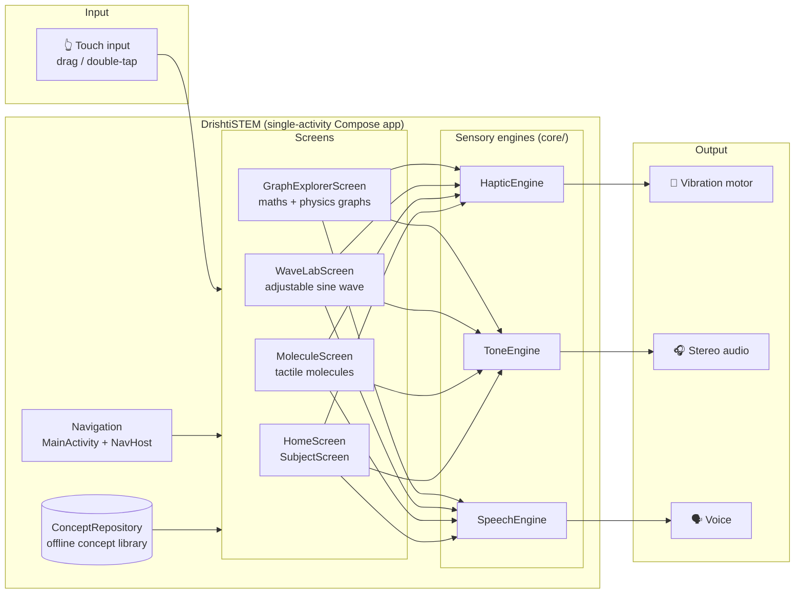
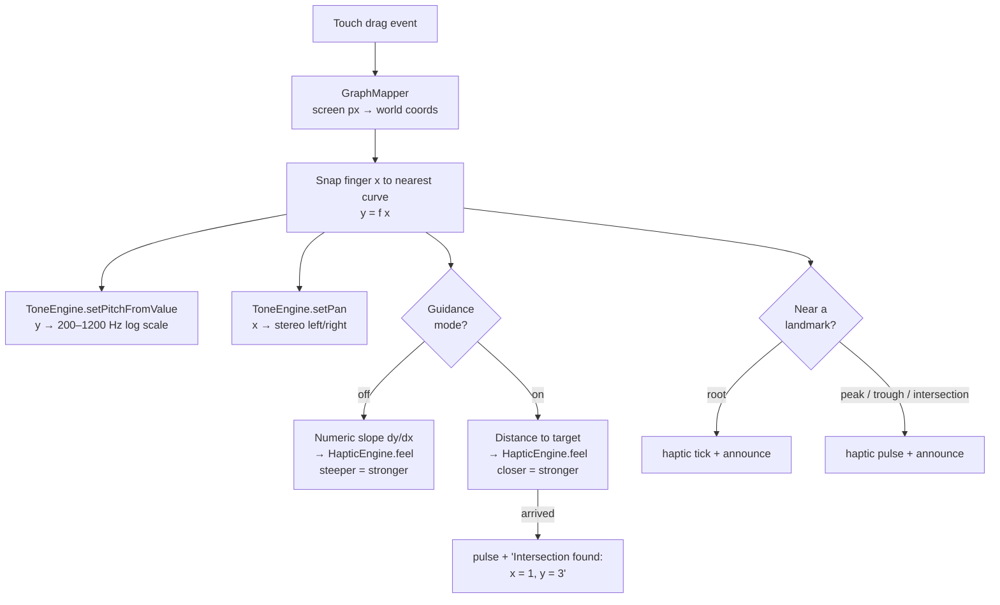
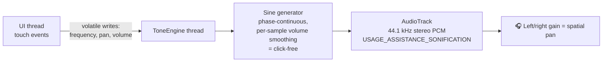
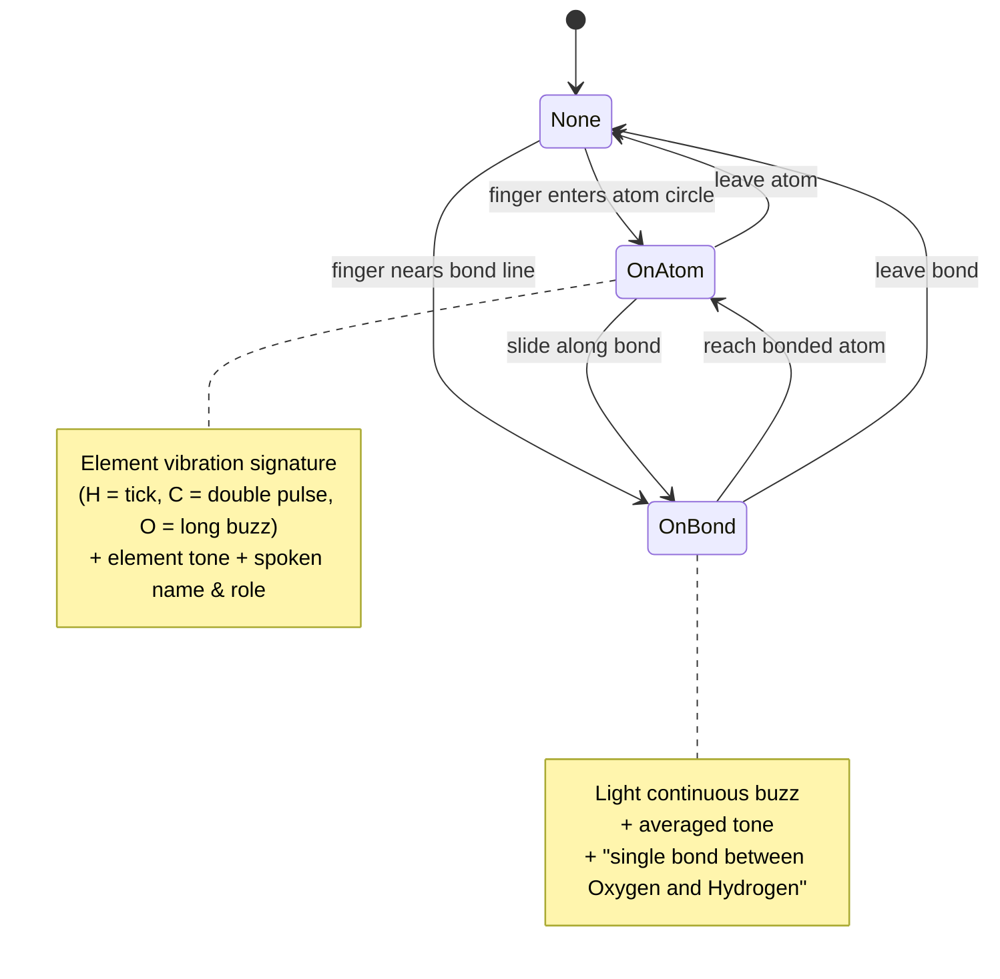
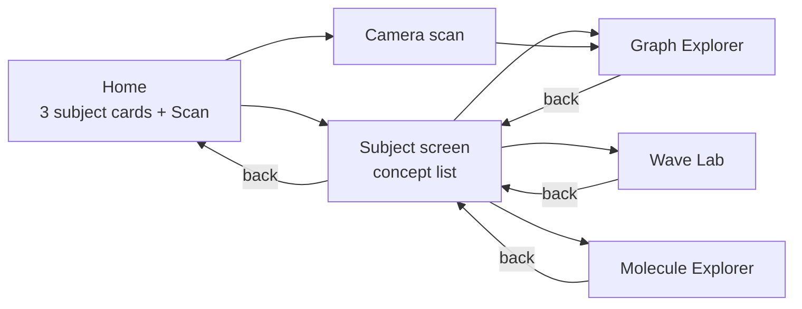
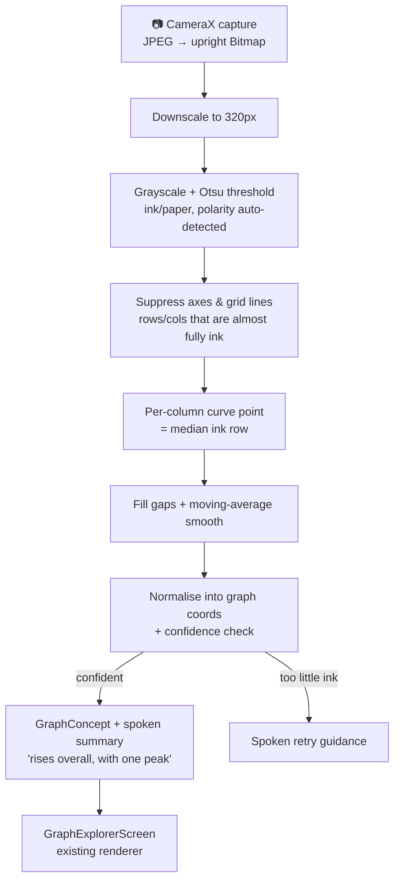

# DrishtiSTEM 👁️🤚🔊

**Turning Visual STEM Into Touch and Sound**

> *"Not a screen reader. A sensory learning platform."*

DrishtiSTEM is a fully **offline Android app** that turns graphs, equations, waves, and molecules into **haptic vibration and spatial audio**, so blind and visually impaired students can explore physics, chemistry, and mathematics independently — no human reader, no internet, no costly Braille hardware.

Built by **Team TechnoBlaze** for the **iQOO Hackathon, Bangalore**.

---

## The Problem

STEM education is heavily visual — graphs, diagrams, equations, and spatial relationships dominate the learning experience.

- **6+ crore** visually impaired people in India
- STEM content remains highly visual and spatial
- Braille STEM tools are **costly and specialist**
- Screen readers are **poor for graphs & formulas**

> Accessibility should not determine educational opportunity.

## The Solution

The phone screen becomes a **tactile canvas**. As a finger explores:

| Sensory channel | Encodes | Example |
|---|---|---|
| 🎵 Tone **pitch** | Height (y-value) | A rising curve sounds higher and higher |
| 🎧 Stereo **pan** | Horizontal position (x) | Left of the graph plays in the left ear |
| 📳 Vibration **amplitude** | Slope / feature strength | A steep climb feels strong, a flat line feels calm |
| 🗣️ **Speech** (TTS) | Landmarks & context | "Peak at x = 2", "Oxygen. Central oxygen atom." |
| 🧭 **Guidance mode** | Proximity to a target | Vibration grows stronger as you home in on an intersection — like GPS for graphs |

Everything runs **100% on-device**: airplane mode is the demo condition, not a limitation.

---

## Architecture

### System overview



### The sensory pipeline (per touch event)

What happens ~120 times per second while a finger traces a graph:



### Audio synthesis



### Chemistry: region state machine

The molecule canvas tracks *what the finger is on*; feedback fires on **transitions**, so resting still is quiet:



### Screen navigation



### Camera scan pipeline (Phase 1.5)

Point the camera at a printed line graph and the **on-device vision pipeline** turns it into the same `GraphConcept` the explorer already renders. It is **pure Kotlin** — no OpenCV, no ML Kit, no model download — so the offline guarantee is untouched (the app adds only the `CAMERA` permission, never `INTERNET`). The captured image is processed in memory and never written to disk.



The pipeline is covered by instrumented tests (`GraphVisionTest`) that feed it synthetic images and assert it parses an upward parabola, detects a rising line, and rejects a blank page.

Every screen **announces itself** on entry (title → intro → gesture instructions), so the app is usable without TalkBack — and cleanly with it (all controls carry `contentDescription`).

---

## Concept library (v1)

| Subject | Concept | What you feel & hear |
|---|---|---|
| 📐 Maths | Straight line `y = x` | Constant slope = steady vibration; pitch climbs evenly |
| 📐 Maths | Parabola `y = x²` | Calm at the vertex, vibration grows with the steepening walls |
| 📐 Maths | Sine `y = sin(x)` | Pitch swells and falls; ticks at every zero crossing; peaks/troughs announced |
| 📐 Maths | Two lines crossing | **Guidance mode**: vibration homes you onto the intersection at (1, 3) |
| ⚛️ Physics | Uniform motion (d–t) | A bus at 2 m/s: perfectly even slope |
| ⚛️ Physics | Acceleration (d–t) | Vibration strengthens as the car speeds up — acceleration becomes touch |
| ⚛️ Physics | Velocity–time | Rising then flat: feel the difference between speeding up and cruising |
| ⚛️ Physics | **Wave Lab** | Build a wave with Freq/Amp buttons, then *hear and feel* it play |
| 🧪 Chemistry | Water H₂O | Bent molecule; oxygen buzzes long, hydrogens tick |
| 🧪 Chemistry | Carbon dioxide CO₂ | Linear; double bonds; carbon's double pulse in the middle |
| 🧪 Chemistry | Methane CH₄ | Central carbon, four hydrogens; structure summary speaks the 109.5° tetrahedron |
| 🧪 Chemistry | Salt NaCl | Dashed **ionic** bond; sodium's triple tick vs chlorine's long-short |

---

## Project structure

```
app/src/main/java/com/technoblaze/drishtistem/
├── MainActivity.kt                  # Single activity, Compose NavHost, engine lifecycle
├── core/
│   ├── Engines.kt                   # Bundles the three engines for the activity's lifetime
│   ├── HapticEngine.kt              # VibrationEffect amplitude mapping, pulse/tick/patterns
│   ├── ToneEngine.kt                # AudioTrack sine synth: pitch = y, pan = x
│   ├── SpeechEngine.kt              # TextToSpeech queue, buffers until engine ready
│   └── vision/GraphVision.kt        # Pure-Kotlin photo → GraphConcept pipeline (Phase 1.5)
├── model/
│   ├── Concept.kt                   # Subject, GraphConcept (+ landmark auto-detection), WaveConcept
│   └── Molecule.kt                  # Element (sensory signatures), Atom, Bond, MoleculeConcept
├── data/
│   ├── ConceptRepository.kt         # The hardcoded offline concept library
│   └── ScannedGraphStore.kt         # In-memory holder for the latest scanned graph
└── ui/
    ├── home/HomeScreen.kt           # Subject cards + Scan entry + concept lists (accessible)
    ├── graph/GraphExplorerScreen.kt # Flagship tactile graph canvas
    ├── wave/WaveLabScreen.kt        # Frequency/amplitude lab
    ├── molecule/MoleculeScreen.kt   # Tactile molecule canvas
    └── camera/CameraScreen.kt       # CameraX capture + permission flow (Phase 1.5)

app/src/androidTest/java/com/technoblaze/drishtistem/
└── GraphVisionTest.kt               # Synthetic-image tests for the scan pipeline
```

**Key design points**

- **No network permission.** The manifest never requests INTERNET — offline is enforced by the OS, not promised by the app. The camera scanner adds only `CAMERA`, and images are processed in memory and never persisted.
- **`minSdk 26`** — the floor for `VibrationEffect` amplitude control (the core of "a rising line feels stronger"). Devices without amplitude control gracefully fall back to duration-modulated pulses.
- **Engines outlive screens.** One `Engines` instance is created in `MainActivity.onCreate` and shared by every screen; `onPause` silences everything instantly.
- **Landmarks are computed, not authored.** `GraphConcept` numerically scans each curve for roots, peaks, and troughs, so adding a new graph is one lambda: `Curve("my curve") { x -> ... }`.

---

## Getting started

### Requirements

- JDK 17
- Android SDK (compileSdk 35) — or just open the project in Android Studio
- A **physical Android phone** (Android 8.0+) — the emulator can't vibrate, and haptics are the point

### Build & install

```bash
./gradlew assembleDebug
adb install -r app/build/outputs/apk/debug/app-debug.apk
```

Or open the folder in Android Studio and press **Run**.

### The 30-second demo

1. **Airplane mode on** — everything still works.
2. Open **Maths → Sine wave**, close your eyes, and trace a finger across the screen: pitch swells and falls with the wave, vibration tracks the slope, and zero crossings tick.
3. Open **Two lines crossing**, double-tap for guidance mode, and let the vibration pull your finger to the intersection.
4. Open **Chemistry → Water** and meet the atoms: oxygen's long buzz, hydrogen's light tick, bonds humming between them.

### Verification checklist

- [ ] `./gradlew assembleDebug` builds clean
- [ ] App launches and home screen announces itself
- [ ] Tracing a graph drives pitch (y), pan (x), and vibration (slope)
- [ ] Guidance mode finds the intersection and announces "x = 1, y = 3"
- [ ] Wave Lab plays the built wave as synchronized sound + vibration
- [ ] Each element in H₂O is distinguishable by feel alone
- [ ] Entire app works in airplane mode
- [ ] With TalkBack on, every control is labelled and reachable

---

## Roadmap

| Phase | Milestone | Status |
|---|---|---|
| 1 | STEM learning pilots: offline concept library | ✅ Built |
| 1.5 | **Camera scan pipeline**: CameraX + on-device, pure-Kotlin vision parses printed line graphs into explorable `GraphConcept`s, reusing the explorer as renderer | ✅ Built |
| 2 | Accessible e-books & diagrams | Planned |
| 3 | Professional training modules | Planned |
| 4 | Universal Accessibility SDK for any Android app | Planned |

---

## Team

**TechnoBlaze** — iQOO Hackathon, Bangalore

> *If knowledge is universal, access to knowledge should be universal too.*
